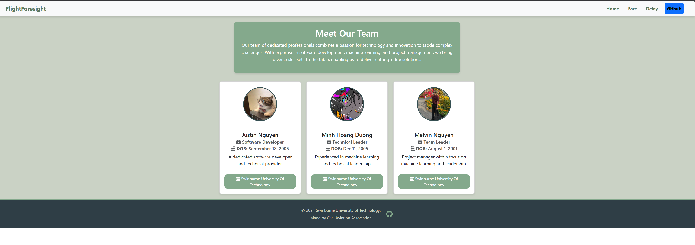

# COS30049 - Computing Technology Innovation Project (CAA Flightforesight)

# Project Screenshots

### Homepage


### Fareflight Prediction - Part 1


### Fareflight Prediction - Part 2


### Delayflight Prediction - Part 1


### Delayflight Prediction - Part 2

## File structure

The project folder is organized into two main subfolders: backend and flightforesight (frontend).

1. Backend: 
    - The `backend` folder is further divided into two main subfolders: `model` and `preprocessor`.
    - The `model` folder contains the backend logic for the web application, including the request processing files and three pre-trained Machine Learning models: `lgbm_regressor_delay.pkl`, `rf_regressor.pkl`, and `xgboost_tuned_model.pkl`.
    - The `preprocessor` folder has code for processing the input data received from the frontend input form.

2. flightforesight (frontend):
    - The `flightforesight` folder is structured as a standard React project, containing `src`, `public`, and `package.json`.
    - Additional files like `airlines.json`, `airports.json`, and `USA_airports.json` are included for user input validation and processing.
    - Inside the `src` folder, there are two subfolders: `assets` and `components`. The assets folder is used to store media files, such as images of team members, while the `components` folder contains the React components that form the frontend of the web application.


```
COS30049-COMPUTING-TECHNOLOGY-INNOVATION-PROJECT_FLIGHTFORESIGHT
│   .DS_Store
│   .gitignore
│   LICENSE
│   README.md
│
├───backend
│   │   .DS_Store
│   │   requirements.txt
│   │  
│   ├───model
│   │      delay_prediction.py
│   │      delay_prediction_db.py
│   │      fare_prediction.py
│   │      fare_prediction_db.py
│   │      lgbm_regressor_delay.pkl
│   │      rf_regressor.pkl
│   │      xgboost_tuned_model.pkl
│   │   
│   └───preprocessor
│           preprocessorfordelay-classify.pkl
│           preprocessorfordelays.pkl
│
└───flightforesight
    │   .gitignore
    │   airlines.json
    │   airports.json
    │   eslint.config.js
    │   index.html
    │   package-lock.json
    │   package.json
    │   README.md
    │   USA_airports.json
    │   vite.config.js
    │
    └───src
        │   App.jsx
        │   main.jsx
        │
        ├───assets
        │       Justin.jpeg
        │       Melvin.jpg
        │       MinhHoangDuong.jpg
        │
        └───components
                components.css
                Delay.jsx
                Fare.jsx
                FlightPath.jsx
                FlightTableForDelay.jsx
                FlightTableForFare.jsx
                Footer.jsx
                home.jsx
                Navbar.jsx
                ScatterPlotForDelay.jsx

```

## Installation
### Flightforesight(Frontend) 

**Important Note**: Ensure that the terminal directory is strictly navigated to the right directory of `./COS30049-COMPUTING-TECHNOLOGY-INNOVATION-PROJECT_FLIGHTFORESIGHT/flightforesight` 

Run the following command to install all the required dependencies

```
npm install
```

### Backend

**Important Note**: Ensure that the terminal directory is strictly navigated to the right directory of `./COS30049-COMPUTING-TECHNOLOGY-INNOVATION-PROJECT_FLIGHTFORESIGHT/backend` 

Run the following command to install all the required dependencies

```
pip install -r requirements.txt
```

## Running

### Flightforesight (frontend)

**Important Note**: Ensure that the terminal directory is strictly navigated to the right directory of `./COS30049-COMPUTING-TECHNOLOGY-INNOVATION-PROJECT_FLIGHTFORESIGHT/flightforesight` 

To start the localhost server hosting the website frontend, run the following command

```
npm run dev
```

If successful, the server should be accessible at:

```
http://localhost:5173/
```

This URL will open the React application in your web browser, allowing you to interact with the frontend.


### Backend

**Important Note**: A new terminal is needed to run the backend concurrently with the frontend. Make sure that this terminal is strictly in the correct directory of `./COS30049-COMPUTING-TECHNOLOGY-INNOVATION-PROJECT_FLIGHTFORESIGHT/backend` 

To start the backend server, use the following commands (one for each function):

```
uvicorn model.fare_prediction:app --reload
```

```
uvicorn model.delay_prediction:app --reload
```

**Note**: Both backend processes use the same port, `8000`, but operate under different endpoints, so they **CANNOT** run at the same time on the same port. If you want to uses one, you must disabled the other.

### Database
**Important Note**: A new terminal is needed to run the backend concurrently with the frontend. Make sure that this terminal is strictly in the correct directory of `./COS30049-COMPUTING-TECHNOLOGY-INNOVATION-PROJECT_FLIGHTFORESIGHT/backend` 
To be able to observe the database of the delay prediction and fare prediction, following these steps:
1. Install the DB browser for SQLite on https://sqlitebrowser.org/dl/. Choose your suitable versions.
2. After installation is complete, open the app (it is called 'DB Browser for SQLite)
3. Choose 'Open Database' and browse for the created database (there are 2 database: fare_prediction.db for fare prediction and delay_prediction.db for delay prediction. 
Both databases are stored in the backend folder.)
4. After opening the database, you can view the tables and data in the database by choosing the 'Browse Data' tab and you could execute SQL commands on 'Execute SQL' tab.
This app is a high quality, visual, open source tool designed for people who want to create, search, and edit SQLite or SQLCipher database files. It works with Windows, macOS, and most versions of Linux and Unix.


